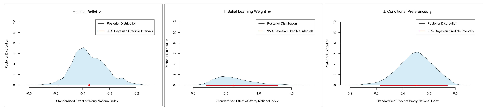
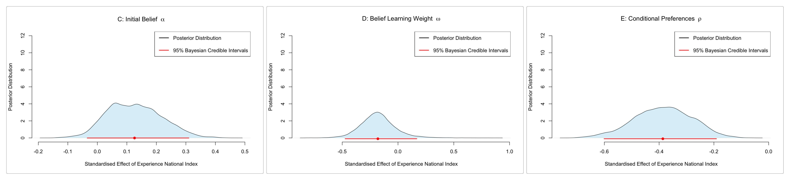

# Conditional Cooperation under National Insecurity

[](https://www.python.org/downloads/)
[](https://github.com/astral-sh/uv)
[](https://github.com/astral-sh/ruff)
[](LICENSE)

A hierarchical Bayesian analysis of how **national (in)security** —
both *perceived* (worry) and *experienced* (harm) — shapes the way people
**conditionally cooperate** in the cross-cultural Public Goods Game of
[Herrmann, Thöni & Gächter (2008)](https://doi.org/10.1126/science.1153808).

> *Originally a Decision Making exam project at Aarhus University
> (MSc Cognitive Science, January 2024). This repository is a modern Python
> re-implementation: the original JAGS / R code is preserved in `legacy_r/`.
> The full original report is in [`docs/full_report.pdf`](docs/full_report.pdf).*

<p align="center">
  
  
</p>

---

## Abstract

This paper examines how real and perceived insecurity affect conditional
cooperation in a public goods game. By examining whether the perceived
insecurity index in a country and the overall outcome for the group in the
game are correlated, and by applying a Bayesian decision model to test whether
individual decisions differ in their social dynamics, we analyse an existing
dataset of groups playing a public goods game in thirteen economically
diverse societies.

**Key findings**

- The *experience* of insecurity does **not** affect contributions.
- People from nations with higher *perceived* insecurity contribute **less**.
- A higher worry index is associated with **lower initial optimism** about
  others' contributions and **increased sensitivity** to others' contributions,
  which together accelerate the decay of cooperation across rounds.

## Research question

> Do nations that **feel** more insecure (worry) or have **lived** more
> insecurity (experience-of-harm) show systematically different
> conditional-cooperation strategies — initial expectations of others
> (α), the slope of one's contribution on belief (ρ), and the rate at which
> beliefs are updated (ω)?

We answer this by fitting a hierarchical Bayesian model on 244 four-player
groups from 13 nations and regressing the three CC parameters on the
**Lloyd's Register 2021 World Risk Poll** worry / experience indices.

## The model — in one paragraph

Each subject's contribution at trial $t$ is a Poisson sample around a
preference $p = \rho \cdot G^b$, where $G^b$ is the subject's belief about the
group's contribution. Beliefs update as a convex combination of the previous
belief and the *observed* group average, weighted by $\omega$. At the national
level, $(\alpha, \rho, \omega)$ are linked to a standardised worry /
experience covariate through log / probit regressions. Full math:
[`docs/model.md`](docs/model.md).

## Repository layout

```
src/conditional_cooperation/   ← Python package (data, model, fit, plots, recovery)
  scripts/                     ← CLI entry points (uv run cc-fit-worry, …)
tests/                         ← pytest suite (data shapes, prior sampling, recovery)
data/                          ← raw Herrmann/Thöni/Gächter CSV + risk indices
docs/                          ← model.md (math), appendixA.pdf (original report)
results/figures/               ← portfolio previews + outputs from fit scripts
legacy_r/                      ← original R + JAGS code, untouched
```

## Quickstart with `uv`

```bash
# 1. Install uv if needed
curl -LsSf https://astral.sh/uv/install.sh | sh

# 2. Clone & install
git clone https://github.com/SylvainEstebe/decision_making_project.git
cd decision_making_project
uv sync --extra dev          # creates .venv and installs locked dependencies

# 3. Sanity-check
uv run pytest                # 11 tests should pass in < 10 s

# 4. Reproduce the analysis
uv run cc-fit-worry --draws 2000 --chains 4
uv run cc-fit-experience --draws 2000 --chains 4
uv run cc-recovery --ngroups 20
```

Outputs land in `results/{worry,experience,parameter_recovery}/` —
NetCDF traces, JSON diagnostics, and figures.

## Key results

Full discussion in [`docs/full_report.pdf`](docs/full_report.pdf). Headline
findings from the original 2024 JAGS fit, reproduced by the Python pipeline:

- **Initial belief about others (α)** is **lower** in nations with higher
  worry — people there start the game expecting less cooperation.
- **Belief-update weight (ω)** is **higher** in higher-worry nations — people
  there react more strongly to what the group just did, accelerating the
  classic decay of contributions over rounds.
- The **matching preference (ρ)** trends downward with national worry, with
  most of its posterior mass below zero on the standardised slope.
- The **experience-of-harm** covariate shows no comparable credible effect on
  any CC parameter — *perception* of insecurity, not lived experience, drives
  the behavioural difference.
- **Parameter recovery** on simulated data shows Pearson r > 0.85 for α and ρ,
  and ~ 0.7 for ω — the model is identifiable on the available trial count.

Figures: see [`results/figures/`](results/figures/). Convergence diagnostics
($\hat R < 1.05$, no divergences at `target_accept=0.95`) are written to
`results/*/diagnostics.json` after each fit.

## Development

```bash
uv run ruff check .          # lint
uv run ruff format .         # format
uv run pytest -m slow        # run the (slow) end-to-end NUTS smoke test
uv run pre-commit install    # install hooks
```

## Citation

If you use this code, please cite via [`CITATION.cff`](CITATION.cff). The
underlying experimental data is from:

> Herrmann, B., Thöni, C., & Gächter, S. (2008). *Antisocial Punishment Across
> Societies.* **Science**, 319(5868), 1362–1367.
> <https://doi.org/10.1126/science.1153808>

## License

MIT — see [`LICENSE`](LICENSE).
